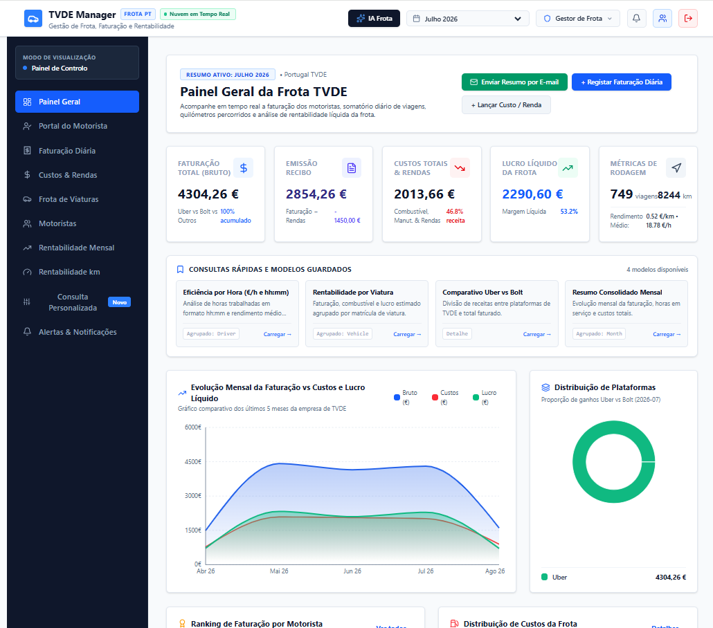
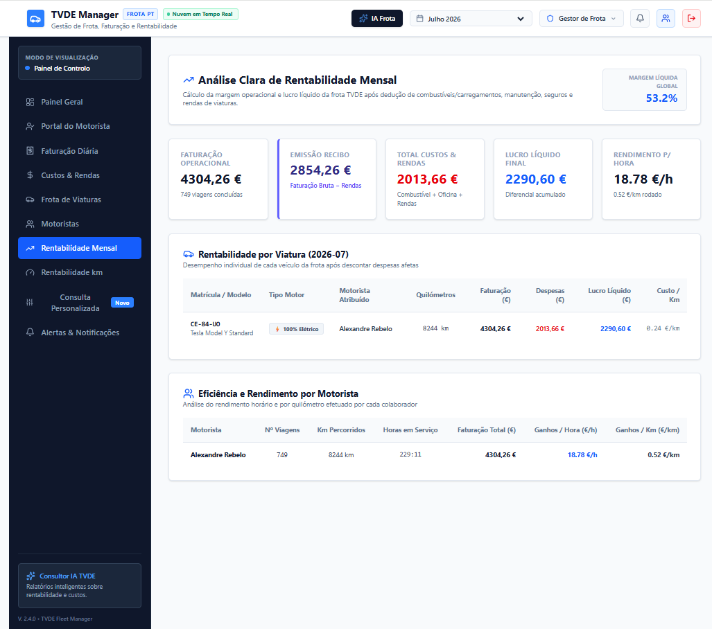
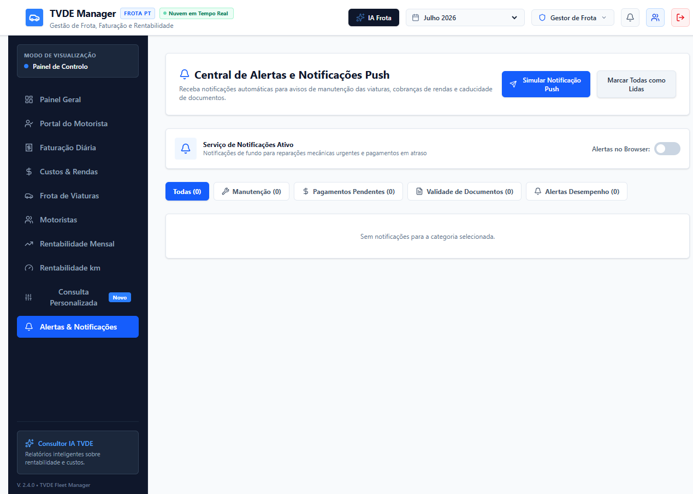

# 🚗 TVDE Fleet Master

### Sistema Inteligente de Gestão de Frotas TVDE

**Plataforma PWA completa para gestão operacional e financeira de frotas TVDE (Uber/Bolt)**

[🌐 **Ver App em Produção**](https://frotatvde.solucoeseficazes.pt/) · [📋 Issues](https://github.com/josreb-cmd/tvde-fleet-master/issues) · [🗺️ Roadmap](#-roadmap)

---

## 📸 Screenshots

### Painel Geral — KPIs em Tempo Real

### Rentabilidade Mensal — Por Viatura e Motorista

### Alertas & Notificações

---

## ✨ Funcionalidades

### 📊 Dashboard & KPIs
- **Painel Geral** com faturação, emissão de recibos, custos, lucro líquido e métricas de rodagem em tempo real
- **Evolução Mensal** — gráfico Faturação vs Custos
- **Distribuição por Plataforma** — Uber vs Bolt
- **Ranking de Faturação** por motorista

### 💰 Gestão Financeira
- **Faturação Diária** — registo e consulta por motorista/viatura
- **Custos & Rendas** — controlo de rendas semanais, energia, manutenção e seguros
- **Rentabilidade Mensal** — análise por viatura e por motorista (ganhos/hora e ganhos/km)
- **Rentabilidade por Km** — identificação do ponto ótimo (~2000 km/semana) com análise de sensibilidade

### 🚘 Gestão de Frota
- **Frota de Viaturas** — registo completo (Tesla Model Y, 100% elétrico)
- **Motoristas** — perfil, documentos e histórico
- **Portal do Motorista** — acesso dedicado para cada condutor

### 🤖 Inteligência Artificial
- **IA Frota** — consulta personalizada com linguagem natural sobre toda a operação
- **Análise Preditiva** — projeções de rentabilidade baseadas em dados reais

### 🔔 Alertas & Notificações
- **Manutenção** — avisos programados
- **Pagamentos Pendentes** — controlo de recibos e faturas
- **Validade de Documentos** — alertas automáticos de expiração
- **Desempenho** — alertas quando métricas saem dos parâmetros esperados

### 📧 Comunicações
- **Resumo por Email** — envio automático via Cloud Functions com credenciais seguras (Secret Manager)

---

## 🏗️ Arquitetura

